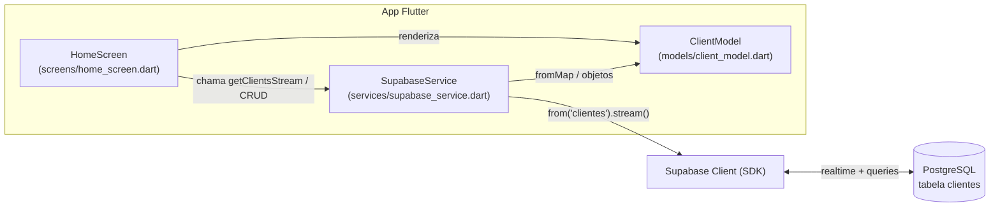

# Documento de Arquitetura e Decisões Técnicas - SGC para MSClean

## 1. Introdução
Este documento detalha a arquitetura de software, a stack de tecnologia (conjunto de tecnologias) e as decisões técnicas tomadas para o desenvolvimento do Sistema de Gestão de Clientes (SGC) da MSClean.

A stack oficial é **Flutter + Supabase**, confirmada na auditoria inicial (`docs/AUDITORIA_INICIAL.md`). Versões anteriores deste documento descreviam Firebase; essa divergência foi corrigida aqui.

## 2. Visão Geral da Arquitetura
O sistema segue um modelo **Cliente-Servidor (Backend as a Service)**. Um front-end multiplataforma se comunica com um serviço de backend gerenciado, eliminando a necessidade de construir e operar um servidor customizado.

* **Front-end (Cliente):** Um aplicativo Flutter que roda em Android e na Web.
* **Backend (BaaS):** O **Supabase**, responsável pelo banco de dados PostgreSQL gerenciado, sincronização em tempo real (realtime) e autorização via Row Level Security (RLS).

**Fluxo de Dados:**
```
[App Android / Web]  <==>  [Supabase Client]  <==>  [PostgreSQL (Supabase)]
```
O app não fala diretamente com o banco: o **Supabase Client** (SDK no Flutter) intermedia toda leitura e escrita, abre a stream de tempo real e carrega a `anonKey` pública. As regras de RLS no PostgreSQL determinam o que essa chave pode acessar.

## 3. Stack de Tecnologia
-   **Linguagem de Programação:** **Dart**. Por ser a linguagem oficial do Flutter, oferece alta performance e um ecossistema robusto.
-   **Framework Front-end:** **Flutter**. Escolhido por sua capacidade de compilar para múltiplas plataformas (Android e Web) a partir de um único código-fonte, acelerando o desenvolvimento e garantindo consistência de interface.
-   **Backend / Banco de Dados:** **Supabase**. Utilizado como BaaS para gerenciar:
    -   **PostgreSQL gerenciado:** banco relacional maduro, com schema explícito e consultas SQL — sem a necessidade de provisionar ou manter servidor de banco.
    -   **Realtime nativo:** alterações na tabela são entregues ao app por streams, sustentando a sincronização em tempo real exigida pelo RNF-004.
    -   **Row Level Security (RLS):** a autorização vive no banco. Como o cliente expõe apenas a `anonKey` pública, são as políticas de RLS que garantem o acesso seguro aos dados (RNF-005).
    -   **Alternativa open-source ao Firebase:** evita lock-in de fornecedor; o Postgres por baixo é portável e padrão de mercado.

## 4. Estrutura do Banco de Dados (PostgreSQL / Supabase)
O banco é relacional, organizado em tabelas.

* **Tabela:** `clientes`
* **Colunas (baseado em `client_model.dart`):**
    -   `id` (uuid / chave primária, gerado pelo Supabase)
    -   `nome` (text)
    -   `endereco` (text)
    -   `telefone` (text)

A tabela é lida via stream ordenada por `nome`. As políticas de RLS aplicáveis a `clientes` controlam o acesso (ver seção 3).

## 5. Estrutura de Diretórios do Projeto
A organização real do código:
```
lib/
├── main.dart                       # inicializa o app e o Supabase via .env
├── models/
│   └── client_model.dart           # ClientModel: id, nome, endereco, telefone
├── screens/
│   └── home_screen.dart            # lista de clientes + barra de busca
└── services/
    └── supabase_service.dart       # acesso ao Supabase (stream de leitura)
```
Fora de `lib/`: `docs/` (esta documentação e os requisitos) e `test/` (testes).

## 6. Diagrama de Componentes
Relação entre as camadas do app e o backend:



Em texto: a **screen** consome o **service**, que conversa com o **Supabase client**; o client lê/escreve no **PostgreSQL**. Os dados trafegam mapeados para o **model** (`ClientModel.fromMap`), que a screen renderiza.

## 7. Decisões Técnicas e Justificativas

* **Por que Supabase e não Firebase.** Decisão histórica registrada em `docs/AUDITORIA_INICIAL.md`: o commit de "reconstrução da base com supabase" trocou o backend, mas a documentação só foi sincronizada agora. Supabase entrega PostgreSQL gerenciado (schema explícito e SQL padrão), realtime nativo e RLS para autorização, além de ser uma alternativa open-source que evita lock-in. Firebase fica fora do projeto.

* **Por que `setState` e não Provider/Riverpod neste estágio.** O escopo é pequeno (uma tela, estado local de busca e a stream de clientes). `setState` cobre essa necessidade sem introduzir uma camada de gerência de estado — evitar overengineering. Quando o app crescer (múltiplas telas compartilhando estado, navegação com dependências), a decisão será reavaliada em favor de uma solução como Provider/Riverpod.

* **Por que busca client-side.** O volume de dados é pequeno (uma prestadora, base na casa das dezenas/centenas de clientes) e a stream já traz a lista completa em memória; filtrar no cliente dá UX em tempo real, sem ida e volta ao servidor a cada tecla. Isso muda quando a base crescer a ponto de não ser razoável manter tudo em memória ou quando a latência incomodar — aí a busca passa a ser feita no servidor (query/filtro no Postgres, ex.: `ilike`/full-text search).

* **Por que sem camada de repository.** Com uma única fonte de dados (Supabase) e operações CRUD diretas, uma camada de `repositories/` adicionaria indireção sem benefício no escopo do MVP. O `SupabaseService` já isola o acesso ao backend. A camada pode ser introduzida se surgirem múltiplas fontes de dados, cache local ou necessidade de trocar o backend sem tocar nas telas.

## 8. Estratégia de Testes
A auditoria registrou cobertura real de 0% — o único teste era o template padrão do Flutter, que falha porque procura widgets inexistentes neste app. A estratégia a partir daqui:

* **Remoção do template quebrado:** substituir `test/widget_test.dart` (smoke test do contador) por testes que cobrem o app real.
* **Teste antes da feature:** conforme decisão da auditoria, o plano de testes precede a implementação de cada feature do MVP.
* **Testes unitários (models/services):** validar `ClientModel.fromMap` (incl. campos ausentes/nulos) e a lógica de filtro do `SupabaseService` (case-insensitive, busca por nome ou endereço, resultado vazio), com o cliente Supabase mockado.
* **Testes de widget (telas):** verificar os estados da `HomeScreen` — carregando, lista vazia ("Nenhum cliente encontrado."), lista populada e filtragem ao digitar na busca.
* **Critérios de aceitação como base:** cada teste rastreia um critério verificável da seção 2 de `requisitos.md` (ex.: campos obrigatórios no cadastro, confirmação antes de excluir).
* **Meta:** nenhuma feature do MVP é considerada pronta sem teste correspondente; o objetivo é manter a suíte verde no CI (sem testes que falham por estarem desatualizados).

## 9. Ambiente de Desenvolvimento
Os seguintes softwares e configurações são necessários para iniciar o desenvolvimento:
-   Flutter SDK
-   Editor de código (Visual Studio Code ou Android Studio)
-   Conta no **Supabase** com o projeto e a tabela `clientes` configurados (incl. políticas de RLS)
-   Arquivo `.env` na raiz do app com `SUPABASE_URL` e `SUPABASE_ANON_KEY` (use o `.env.example` como referência; o `.env` real fica fora do controle de versão)
