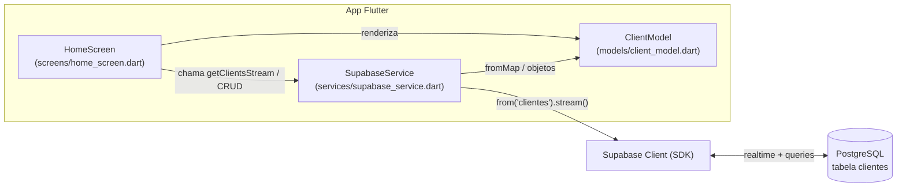

# Documento de Arquitetura e Decisões Técnicas - SGC para MSClean

## 1. Introdução
Este documento detalha a arquitetura de software, a stack de tecnologia (conjunto de tecnologias) e as decisões técnicas tomadas para o desenvolvimento do Sistema de Gestão de Clientes (SGC) da MSClean.

A stack oficial é **Flutter + Supabase**, confirmada na auditoria inicial (`docs/AUDITORIA_INICIAL.md`). Versões anteriores deste documento descreviam Firebase; essa divergência foi corrigida aqui.

## 2. Visão Geral da Arquitetura
O sistema segue um modelo **Cliente-Servidor (Backend as a Service)**. Um front-end multiplataforma se comunica com um serviço de backend gerenciado, eliminando a necessidade de construir e operar um servidor customizado.

* **Front-end (Cliente):** Um aplicativo Flutter que roda em Android e na Web.
* **Backend (BaaS):** O **Supabase**, responsável pelo banco de dados PostgreSQL gerenciado, sincronização em tempo real (realtime) e autorização via Row Level Security (RLS).

**Fluxo de Dados:**
```
[App Android / Web]  <==>  [Supabase Client]  <==>  [PostgreSQL (Supabase)]
```
O app não fala diretamente com o banco: o **Supabase Client** (SDK no Flutter) intermedia toda leitura e escrita, abre a stream de tempo real e carrega a `anonKey` pública. As regras de RLS no PostgreSQL determinam o que essa chave pode acessar.

## 3. Stack de Tecnologia
-   **Linguagem de Programação:** **Dart**. Por ser a linguagem oficial do Flutter, oferece alta performance e um ecossistema robusto.
-   **Framework Front-end:** **Flutter**. Escolhido por sua capacidade de compilar para múltiplas plataformas (Android e Web) a partir de um único código-fonte, acelerando o desenvolvimento e garantindo consistência de interface.
-   **Backend / Banco de Dados:** **Supabase**. Utilizado como BaaS para gerenciar:
    -   **PostgreSQL gerenciado:** banco relacional maduro, com schema explícito e consultas SQL — sem a necessidade de provisionar ou manter servidor de banco.
    -   **Realtime nativo:** alterações na tabela são entregues ao app por streams, sustentando a sincronização em tempo real exigida pelo RNF-004.
    -   **Row Level Security (RLS):** a autorização vive no banco. Como o cliente expõe apenas a `anonKey` pública, são as políticas de RLS que garantem o acesso seguro aos dados (RNF-005).
    -   **Alternativa open-source ao Firebase:** evita lock-in de fornecedor; o Postgres por baixo é portável e padrão de mercado.

## 4. Estrutura do Banco de Dados (PostgreSQL / Supabase)
O banco é relacional, organizado em tabelas.

* **Tabela:** `clientes`
* **Colunas (baseado em `client_model.dart`):**
    -   `id` (uuid / chave primária, gerado pelo Supabase)
    -   `nome` (text)
    -   `endereco` (**jsonb**, opcional — endereço estruturado, issue #65): objeto com as chaves `logradouro`, `numero`, `bairro`, `complemento` e `referencia` (todas text; ausência de qualquer chave é lida como vazio). Modela casa/apartamento/condomínio num só formato e alimenta o resumo da lista, a busca e a consulta ao mapa. Sem chaves de CEP/cidade: a área de atendimento é só Campo Grande - MS, âncora fixa (`Endereco.cidadeFixa`) na consulta ao Maps. Era `text` até a issue #61.
    -   `telefones` (text[] — um ou mais números por cliente, issue #62)

A tabela é lida via stream ordenada por `nome`. O mapeamento jsonb ⇄ objeto vive no value object `Endereco` (`lib/models/endereco.dart`), aninhado em `ClientModel`.

**Row Level Security.** A tabela `clientes` tem RLS habilitada, com uma única política verificada em produção: `mvp_acesso_total_anon` (`FOR ALL`, role `anon`, `USING (true)` e `WITH CHECK (true)`). Na prática, com o RLS ligado, a role `anon` — a mesma que a `anonKey` pública carregada pelo app assume — tem acesso total de leitura e escrita à tabela, sem nenhum filtro por linha. Essa permissividade é **deliberada** para o estágio atual (usuária única, app ainda não distribuído publicamente) e tem prazo de validade: deve ser substituída por políticas restritivas quando o RF-007 (autenticação) for implementado. Ver as dívidas técnicas (seção 9) e os riscos (seção 10).

## 5. Estrutura de Diretórios do Projeto
A organização real do código:
```
lib/
├── main.dart                       # inicializa o app e o Supabase via .env
├── models/
│   ├── client_model.dart           # ClientModel: id, nome, endereco (Endereco), telefones
│   └── endereco.dart               # Endereco: value object do endereço estruturado (jsonb)
├── screens/
│   ├── home_screen.dart            # lista de clientes + barra de busca
│   └── client_form_screen.dart     # formulário de cadastro (RF-001; reusável na edição)
├── services/
│   └── supabase_service.dart       # acesso ao Supabase (stream de leitura + insert)
└── utils/
    └── validators.dart             # validações puras do formulário (obrigatório, telefone)
```
Fora de `lib/`: `docs/` (esta documentação e os requisitos) e `test/` (testes).

## 6. Diagrama de Componentes
Relação entre as camadas do app e o backend:



Em texto: a **screen** consome o **service**, que conversa com o **Supabase client**; o client lê/escreve no **PostgreSQL**. Os dados trafegam mapeados para o **model** (`ClientModel.fromMap`), que a screen renderiza.

## 7. Decisões Técnicas e Justificativas

* **Por que Supabase e não Firebase.** Decisão histórica registrada em `docs/AUDITORIA_INICIAL.md`: o commit de "reconstrução da base com supabase" trocou o backend, mas a documentação só foi sincronizada agora. Supabase entrega PostgreSQL gerenciado (schema explícito e SQL padrão), realtime nativo e RLS para autorização, além de ser uma alternativa open-source que evita lock-in. Firebase fica fora do projeto.

* **Por que `setState` e não Provider/Riverpod neste estágio.** O escopo é pequeno (uma tela, estado local de busca e a stream de clientes). `setState` cobre essa necessidade sem introduzir uma camada de gerência de estado — evitar overengineering. Quando o app crescer (múltiplas telas compartilhando estado, navegação com dependências), a decisão será reavaliada em favor de uma solução como Provider/Riverpod.

* **Por que busca client-side.** O volume de dados é pequeno (uma prestadora, base na casa das dezenas/centenas de clientes) e a stream já traz a lista completa em memória; filtrar no cliente dá UX em tempo real, sem ida e volta ao servidor a cada tecla. Isso muda quando a base crescer a ponto de não ser razoável manter tudo em memória ou quando a latência incomodar — aí a busca passa a ser feita no servidor (query/filtro no Postgres, ex.: `ilike`/full-text search).

* **Por que sem camada de repository.** Com uma única fonte de dados (Supabase) e operações CRUD diretas, uma camada de `repositories/` adicionaria indireção sem benefício no escopo do MVP. O `SupabaseService` já isola o acesso ao backend. A camada pode ser introduzida se surgirem múltiplas fontes de dados, cache local ou necessidade de trocar o backend sem tocar nas telas.

## 8. Estratégia de Testes
A auditoria registrou cobertura real de 0% — o único teste era o template padrão do Flutter, que falha porque procura widgets inexistentes neste app. A estratégia a partir daqui:

* **Remoção do template quebrado:** substituir `test/widget_test.dart` (smoke test do contador) por testes que cobrem o app real.
* **Teste antes da feature:** conforme decisão da auditoria, o plano de testes precede a implementação de cada feature do MVP.
* **Testes unitários (models/services):** validar `ClientModel.fromMap` (incl. campos ausentes/nulos) e a lógica de filtro do `SupabaseService` (case-insensitive, busca por nome ou endereço, resultado vazio), com o cliente Supabase mockado.
* **Testes de widget (telas):** verificar os estados da `HomeScreen` — carregando, lista vazia ("Nenhum cliente encontrado."), lista populada e filtragem ao digitar na busca.
* **Critérios de aceitação como base:** cada teste rastreia um critério verificável da seção 2 de `requisitos.md` (ex.: campos obrigatórios no cadastro, confirmação antes de excluir).
* **Meta:** nenhuma feature do MVP é considerada pronta sem teste correspondente; o objetivo é manter a suíte verde no CI (sem testes que falham por estarem desatualizados).

## 9. Dívidas Técnicas Conhecidas

| Item | Razão | Quando reavaliar |
|---|---|---|
| Sem autenticação no MVP | Usuária única no próprio dispositivo; RLS é o controle de segurança | Quando houver mais de um usuário ou necessidade de auditoria |
| Busca client-side | Volume pequeno justifica filtrar em memória; UX em tempo real sem ida ao servidor | Quando a base ultrapassar ~500 clientes ou latência incomodar |
| Sem camada de repository | Escopo MVP com fonte única (Supabase) não justifica indireção | Quando surgir cache local, múltiplas fontes ou troca de backend |
| Tabela `clientes` em português | Decisão histórica do código atual; refactor envolve renomear tabela, ajustar service e migrar dados | Em refactor futuro com padronização para inglês |
| RLS deliberadamente permissiva | Política `mvp_acesso_total_anon` dá acesso total à role `anon` (`USING/WITH CHECK (true)`); aceitável só enquanto o app tem usuária única e não é distribuído | Ao implementar o RF-007 (autenticação): trocar por políticas restritivas por usuário |
| `.env.example` ausente | Quem clona o repositório não sabe quais chaves preencher | Próximo passo imediato (já listado na auditoria) |
| `pubspec.yaml` com descrição genérica | Ainda está com o placeholder "A new Flutter project." | Junto com a criação do .env.example |
| `print()` em produção | Usado em home_screen para o onTap; saída sem propósito de log | No refactor da tela de detalhes (RF futuro) |

## 10. Riscos e Mitigações

| Risco | Probabilidade | Impacto | Mitigação |
|---|---|---|---|
| Política de RLS permissiva expor dados de clientes | Média | Alto | Risco residual conhecido: com a `mvp_acesso_total_anon`, qualquer um de posse da `anonKey` tem acesso total à tabela. Mitigação real: não distribuir a `anonKey` amplamente (app não publicado) até o RF-007 substituir a política por regras restritivas |
| Crescimento da base degradar a busca client-side | Baixa (curto prazo) | Médio | Monitorar volume; migrar para busca server-side (ilike/full-text) quando ultrapassar limiar de ~500 registros |
| Perda do `.env` por falta de exemplo no repositório | Alta | Médio | Criar `.env.example` com chaves esperadas e instruções |
| Documentação voltar a divergir do código | Média | Médio | Definição de pronto inclui atualização de docs; revisão a cada commit que mexer em model, stack ou estrutura |
| Cobertura zero permitir regressões silenciosas | Alta (hoje) | Alto | Substituir template de teste; plano de testes precede cada feature do MVP (ver seção 8) |

## 11. Histórico de Versões

| Data | Versão | Autor | Descrição da mudança |
|---|---|---|---|
| 2025-09-11 | 1.0 | Wilson Gorosthides | Versão inicial (descrevia Firebase) |
| 2026-06-27 | 2.0 | Wilson Gorosthides | Sincronização com auditoria: Supabase, model real, justificativas técnicas, estratégia de testes |
| 2026-06-27 | 2.1 | Wilson Gorosthides | Adição das seções de dívidas técnicas, riscos e histórico de versões |
| 2026-07-08 | 2.2 | Wilson Gorosthides | Documentação da política de RLS `mvp_acesso_total_anon` (verificada em produção, deliberadamente permissiva até o RF-007) nas seções 4, 9 e 10 |
| 2026-07-15 | 2.3 | Wilson Gorosthides | Atualiza a estrutura de diretórios (§5) com o RF-001: `client_form_screen.dart`, `utils/validators.dart` e o insert no service |
| 2026-07-21 | 2.4 | Wilson Gorosthides | Schema da tabela `clientes` (§4): `endereco` passa a opcional (#61) e `telefone` (text) vira `telefones` (text[], um ou mais números por cliente, #62); árvore §5 atualizada. Requer migração no Supabase. |
| 2026-07-21 | 2.5 | Wilson Gorosthides | Schema da tabela `clientes` (§4): `endereco` passa de text para **jsonb** com endereço estruturado (logradouro, número, bairro, complemento, referência; sem CEP/cidade — área de atendimento fixa em Campo Grande - MS); novo value object `Endereco` (`lib/models/endereco.dart`) na árvore §5. Requer migração no Supabase (text → jsonb, issue #65). |

## 12. Ambiente de Desenvolvimento
Os seguintes softwares e configurações são necessários para iniciar o desenvolvimento:
-   Flutter SDK
-   Editor de código (Visual Studio Code ou Android Studio)
-   Conta no **Supabase** com o projeto e a tabela `clientes` configurados (incl. políticas de RLS)
-   Arquivo `.env` na raiz do app com `SUPABASE_URL` e `SUPABASE_ANON_KEY` (use o `.env.example` como referência; o `.env` real fica fora do controle de versão)
